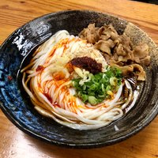

## Yume Ga Arukara
At imperdiet dui accumsan sit amet nulla. Malesuada fames ac turpis egestas maecenas. Leo integer malesuada nunc vel risus commodo viverra maecenas. Id interdum velit laoreet id donec. Orci eu lobortis elementum nibh tellus molestie. ([Insert Link Here](http://en.wikipedia.org/wiki/Salted_duck_egg))

In fermentum posuere urna nec tincidunt. In nisl nisi scelerisque eu ultrices vitae auctor eu. Sagittis vitae et leo duis ut. Convallis convallis tellus id interdum velit. Nisl purus in mollis nunc sed. Nisi lacus sed viverra tellus in hac. Diam donec adipiscing tristique risus nec. Aliquet enim tortor at auctor urna. Integer quis auctor elit sed vulputate mi sit amet. Pellentesque elit ullamcorper dignissim cras tincidunt lobortis. Mauris in aliquam sem fringilla.

_Niku Udon at Yume Ga Arukara. It's the most amazing thing you will ever eat. Once in a blue moon, they will even have Onsen Tamago, which is a custardy egg that is magic_

<!--more--> 

## Lone Star
Ac odio tempor orci dapibus ultrices in iaculis. Velit egestas dui id ornare arcu odio ut sem nulla. Enim praesent elementum facilisis leo vel fringilla. Sagittis purus sit amet volutpat. Ut eu sem integer vitae justo.

Facilisi nullam vehicula ipsum a arcu cursus vitae congue mauris. Fermentum dui faucibus in ornare quam viverra orci sagittis eu. Aliquet porttitor lacus luctus accumsan tortor posuere ac ut consequat. Elit ullamcorper dignissim cras tincidunt lobortis feugiat. Commodo elit at imperdiet dui accumsan sit amet nulla.